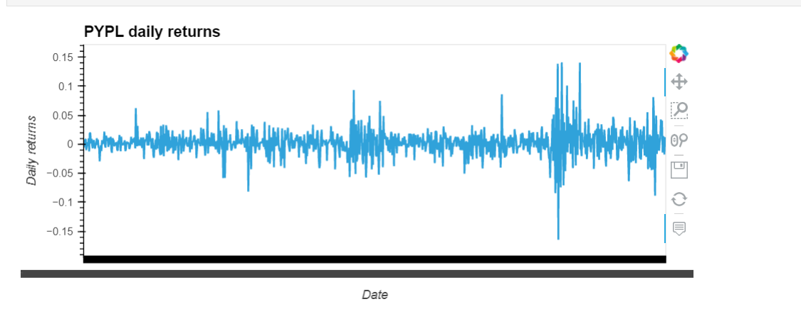
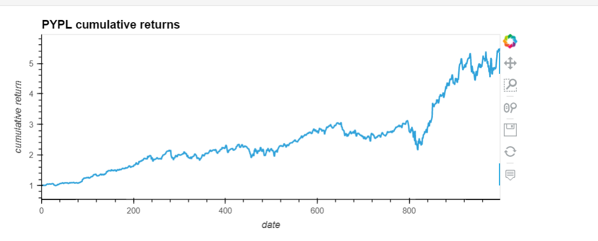
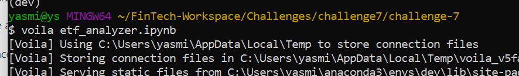

# Project Background

 This project build a financial database and web application by using SQL, Python, and the Voilà library to analyze the performance of a hypothetical fintech ETF.

 The project uses python 3.7 and SQL as a programming language and Jupyter Lab notebook. 

 ## Usage
Creating an interactive visualization for the PYPL daily returns
 

Creating an interactive visualization for the PYPL cumulative returns

 

Finally, we use Voila library to deploy your notebook as a web application:
 

## Contributors

Yasmin Sharbaf

Questions? Contact through linkedin:
https://www.linkedin.com/in/yasmin-sharbaf

